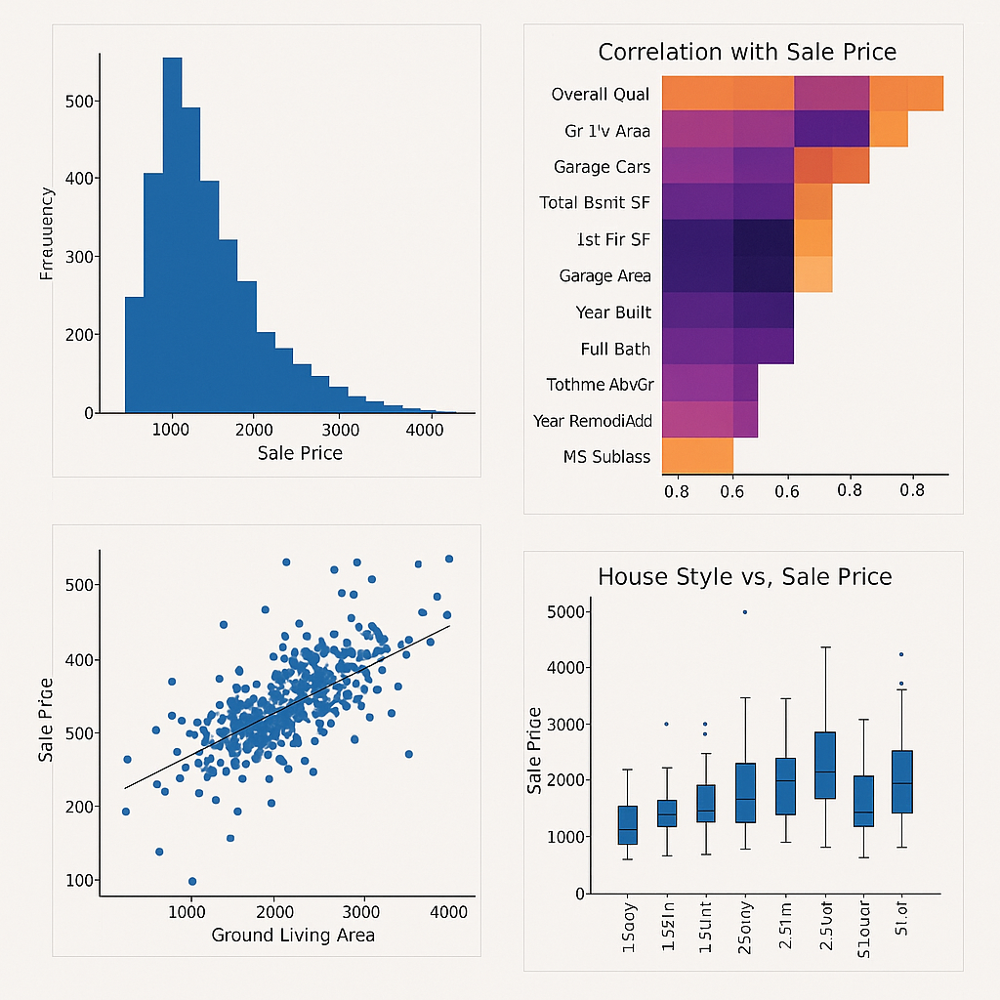

# 🏡 House Price Prediction – Advanced Regression Project



[](https://www.python.org/)
[](https://opensource.org/licenses/MIT)
[](https://www.kaggle.com/competitions/house-prices-advanced-regression-techniques)

This project aims to predict housing prices using advanced regression techniques, with a focus on feature engineering, EDA, and model interpretability.

---

## 📁 Project Structure
```
house-price-prediction/
├── data/                   # Dataset files (train.csv, test.csv)
├── eda_house.ipynb         # Exploratory Data Analysis notebook
├── preprocess.py           # Data preprocessing & feature engineering
├── train_model.py          # Training various regression models
├── make_submission.py      # Create Kaggle submission file
├── A_collection_of_four_data_visualizations_related_t.png  # Thumbnail
└── README.md               # Project documentation
```

---

## 🔍 Exploratory Data Analysis (EDA)
- Target variable: `SalePrice` distribution
- Missing value analysis
- Top correlated features with `SalePrice`
- Categorical features with boxplots
- Scatterplots and pairplots of top numeric features

---

## 🛠️ Feature Engineering Highlights
- Handling missing values contextually
- Creating interaction terms (e.g., `OverallQual * GrLivArea`)
- Binning and encoding of categorical variables
- Log-transforming skewed features
- Scaling numerical features

---

## 🤖 Models Trained
- Linear Regression, Ridge, Lasso
- XGBoost, LightGBM
- Stacking Regressor for ensemble performance
- Cross-validation with RMSE metric

---

## 📈 Best Model Performance
Achieved competitive RMSE on the Kaggle leaderboard with a stacked ensemble model using tuned hyperparameters and engineered features.

---

## 📦 Requirements
```bash
pip install -r requirements.txt
```

---

## 🚀 How to Run
```bash
python preprocess.py
python train_model.py
python make_submission.py
```

---

## 📄 License
This project is licensed under the [MIT License](https://opensource.org/licenses/MIT).

## 👤 Author
Created by [Alp Yaman](https://github.com/yourgithubusername)
